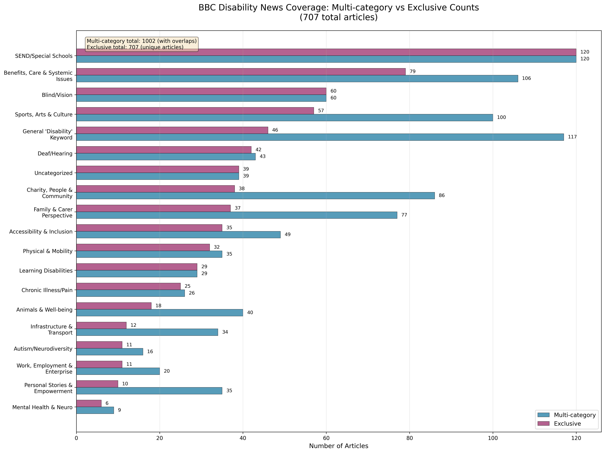
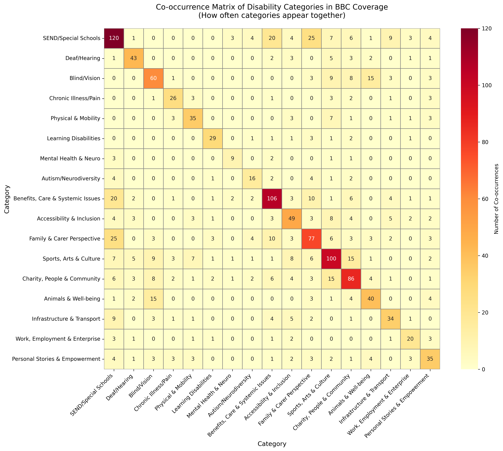

# BBC Disability News Coverage Analysis

A quantitative analysis of disability representation patterns in BBC News' dedicated disability section (January-July 2025).

## Key Findings

Analysis of 707 headlines from [BBC's disability section](https://www.bbc.co.uk/news/disability) reveals:

- **3.9:1 ratio** between visible and invisible disability coverage
- **Mental health receives 0.8%** of coverage despite affecting 1 in 4 people
- **SEND/Special Schools dominates at 17%** of all coverage
- **Diagonal pattern in co-occurrence matrix** shows disabilities presented in isolation rather than as intersectional experiences





## Methodology

This analysis employs a dual methodology:

1. **Multi-category analysis**: Measures thematic prevalence (articles can match multiple categories)
2. **Exclusive categorization**: Provides unique article distribution for statistical validity

The approach reveals that BBC disability coverage averages 1.42 category matches per article, yet the co-occurrence heatmap shows minimal intersection between different disability experiences in how stories are framed.

## Dataset

- **Source**: Complete scrape of https://www.bbc.co.uk/news/disability
- **Period**: January 1 - July 29, 2025
- **Size**: 707 articles
- **File**: `bbc-2025-07-29.csv`

## Usage

```bash
# Clone the repository
git clone https://github.com/[username]/bbc-disability-analysis
cd bbc-disability-analysis

# Install requirements
pip install pandas matplotlib seaborn numpy

# Run analysis
python bbc_analysis_v3.py
